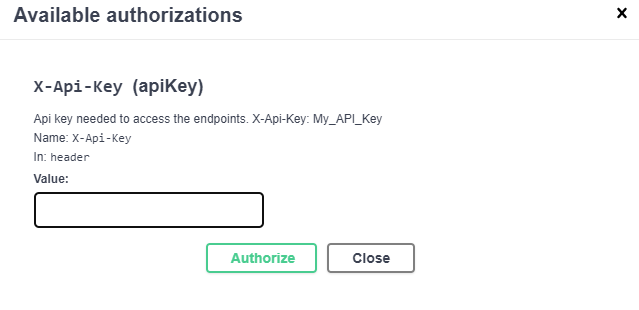

# Partner Management Application

[](https://github.com/mehdihadeli/partners-management/actions)

With using this application the partners of a specific company can order their product through the APIs based on their needs.

> This app is based on .Net core and vertical slices architecture and I wrote some level of test like unit testing, integration testing and end-to-end testing for this application.

This app hosted on the [heroku](https://heroku.com/) for demo purpose in bellow address:

[https://partners-management.herokuapp.com/swagger](https://partners-management.herokuapp.com/swagger)

## Application Structure

In this application I used a [mediator pattern](https://dotnetcoretutorials.com/2019/04/30/the-mediator-pattern-in-net-core-part-1-whats-a-mediator/) with using [MediatR](https://github.com/jbogard/MediatR) library in my controllers for a clean and [thin controller](https://codeopinion.com/thin-controllers-cqrs-mediatr/), also instead of using a `application service` class because after some times our controller will depends to different services and this breaks single responsibility principle. 

Mediator mediate between objects and prevent direct coupling between objects, and objects could communicate each other with sending some message through mediator as a gateway. Here We use mediator pattern to manage the delivery of messages to handlers. For example in our controllers we create a command and send it to mediator and mediator will route our command to a specific command handler in application layer. 

One of the advantages behind the [mediator pattern](https://lostechies.com/jimmybogard/2014/09/09/tackling-cross-cutting-concerns-with-a-mediator-pipeline/) is that it allows us to define some pipelines of activities for requests on top of our mediator for doing some cross cutting concerns that brings [Single Responsibility Principle](https://en.wikipedia.org/wiki/Single_responsibility_principle) and [Don't Repeat Yourself principles](https://en.wikipedia.org/wiki/Don%27t_repeat_yourself) in our application.

For implementing these pipelines in our mediator to handle cross-cutting concerns we use MediatR libraries and its [Pipeline Behaviors](https://github.com/jbogard/MediatR/wiki/Behaviors) or we can create some [MediatR Decorators](https://lostechies.com/jimmybogard/2014/09/09/tackling-cross-cutting-concerns-with-a-mediator-pipeline/) as our pipelines.

Also in this project I used [vertical slice architecture](https://jimmybogard.com/vertical-slice-architecture/) or [Restructuring to a Vertical Slice Architecture](https://codeopinion.com/restructuring-to-a-vertical-slice-architecture/) also I used [feature folder structure](http://www.kamilgrzybek.com/design/feature-folders/) in this project.

I treat each request as a distinct use case or slice, encapsulating and grouping all concerns from front-end to back.
When adding or changing a feature in an application in n-tire architecture, we are typically touching many different "layers" in an application. we are changing the user interface, adding fields to models, modifying validation, and so on. Instead of coupling across a layer, we couple vertically along a slice. we `Minimize coupling` `between slices`, and `maximize coupling` `in a slice`.

With this approach, each of our vertical slices can decide for itself how to best fulfill the request. New features only add code, we're not changing shared code and worrying about side effects. For implementing vertical slice architecture using cqrs pattern is a good match.


Also here I used cqrs for decompose my features to very small parts that make our application

- maximize performance, scalability and simplicity.
- adding new feature to this mechanism is very easy without any breaking change in other part of our codes. New features only add code, we're not changing shared code and worrying about side effects.
- easy to maintain and any changes only affect on one command or query (or a slice) and avoid any breaking changes on other parts
- it gives us better separation of concerns and cross cutting concern (with help of mediatr behavior pipelines) in our code instead of a big service class for doing a lot of things.  


With using CQRS pattern, we cut each business functionality into some vertical slices, and inner each of this slices we have [technical folders structure](http://www.kamilgrzybek.com/design/feature-folders/) specific to that feature (command, handlers, infrastructure, repository, controllers, ...). In Our CQRS pattern each command/query handler is a separate slice. This is where you can reduce coupling between layers. Each handler can be a separated code unit, even copy/pasted. Thanks to that, we can tune down the specific method to not follow general conventions (e.g. use custom SQL query or even different storage). In a traditional layered architecture, when we change the core generic mechanism in one layer, it can impact all methods. 

For checking `validation rules` we use two type of validation: 
- [Data Validation](http://www.kamilgrzybek.com/design/rest-api-data-validation/): Data validation verify data items which are coming to our application from external sources and check if theirs values are acceptable but Business rules validation is a more broad concept and more close to how business works and behaves. So it is mainly focused on behavior For implementing data validation I used [FluentValidation](https://github.com/FluentValidation/FluentValidation) library for cleaner validation also better separation of concern in my handlers for preventing mixing validation logic with orchestration logic in my handlers.
- [Business Rules validation](http://www.kamilgrzybek.com/design/domain-model-validation/): I explicitly check all of the our business rules, inner my handlers and I will throw a customized exception based on the error that these errors should inherits from [AppException](./src/BuildingBlocks/BulidingBlocks/Exception/AppException.cs) class, because of these exceptions, occurs in application layer and we catch this exceptions in api layer with using [Hellang.Middleware.ProblemDetails](https://www.nuget.org/packages/Hellang.Middleware.ProblemDetails/) middleware and pass a correct status code to client.
 
Examples of `data validation` :

1- Input Validation
- We want to ensure our Id is greater than zero.

In bellow validator for our query as request we check that Id is greater than zero

``` csharp
public class FetchOrderByIdQueryValidator : AbstractValidator<FetchOrderByIdQuery>
{
    public FetchOrderByIdQueryValidator()
    {
        RuleFor(query => query.Id).GreaterThan(0).WithMessage("id should be greater than zero.");
    }
}
```

2- Business Rule Validation
- We want to check our database contains a order with specific Id and if there is no order with this Id, we throw a [OrderNotFoundException](./src/PartnersManagement/Orders/Exceptions/OrderNotFoundException.cs).

``` csharp
var existOrder = await _dbContext.Orders.Include(x => x.OrderItems)
                .FirstOrDefaultAsync(x => x.Id == query.Id, cancellationToken);

if (existOrder is null)
    throw new OrderNotFoundException(query.Id);
```

Also for handling exceptions and correct status codes in our web api response, I Used [Hellang.Middleware.ProblemDetails](https://www.nuget.org/packages/Hellang.Middleware.ProblemDetails/) package and I config and map all our needed exceptions and their corresponding status code in our [Configurations](./src/PartnersManagement/Configurations.cs) class.

``` csharp
services.AddProblemDetails(x =>
    {
        // Control when an exception is included
        x.IncludeExceptionDetails = (ctx, _) =>
        {
            // Fetch services from HttpContext.RequestServices
            var env = ctx.RequestServices.GetRequiredService<IHostEnvironment>();
            return env.IsDevelopment() || env.IsStaging();
        };
        x.Map<AppException>(ex => new ProblemDetails
        {
            Title = "Application rule broken",
            Status = StatusCodes.Status409Conflict,
            Detail = ex.Message,
            Type = "https://somedomain/application-rule-validation-error",
        });
        // Exception will produce and returns from our FluentValidation RequestValidationBehavior
        x.Map<ValidationException>(ex => new ProblemDetails
        {
            Title = "input validation rules broken",
            Status = StatusCodes.Status400BadRequest,
            Detail = JsonConvert.SerializeObject(ex.ValidationResultModel.Errors),
            Type = "https://somedomain/input-validation-rules-error",
        });
        ////
        ////
    });
```

In this Project I covered most of important tests like `Unit Testing`, `Integration Testing` and `End To End` testing. For naming tests, I used [vladimir khorikov](https://enterprisecraftsmanship.com/posts/you-naming-tests-wrong/) naming convention in his article and it makes our tests more readable like a documentation for our developers.

In this app for increasing performance we could use caching mechanism simply with implementing a interface `ICachePolicy<,>` and our object for caching, this will handle with a chancing pipeline on mediateR as cross cutting concern with name of `CachingBehavior`. For example for caching our `FindOrderByIdQuery` query we could use bellow code:

``` csharp
public class FetchOrderByIdQuery : IQuery<FetchOrderByIdQueryResult>
{
    public FetchOrderByIdQuery(long id)
    {
        Id = id;
    }

    public long Id { get; }

    public class CachePolicy : ICachePolicy<FetchOrderByIdQuery, FetchOrderByIdQueryResult>
    {
        public DateTimeOffset? AbsoluteExpirationRelativeToNow => DateTimeOffset.Now.AddMinutes(15);

        public string GetCacheKey(FetchOrderByIdQuery query)
        {
            return CacheKey.With(query.GetType(), query.Id.ToString());
        }
    }
}
```

## Technologies - Libraries
- ✔️ **[`.NET Core 5`](https://dotnet.microsoft.com/download)** - .NET Framework and .NET Core, including ASP.NET and ASP.NET Core
- ✔️ **[`Newtonsoft.Json`](https://github.com/JamesNK/Newtonsoft.Json)** - Json.NET is a popular high-performance JSON framework for .NET
- ✔️ **[`MVC Versioning API`](https://github.com/microsoft/aspnet-api-versioning)** - Set of libraries which add service API versioning to ASP.NET Web API, OData with ASP.NET Web API, and ASP.NET Core
- ✔️ **[`FluentValidation`](https://github.com/FluentValidation/FluentValidation)** - Popular .NET validation library for building strongly-typed validation rules
- ✔️ **[`Swagger & Swagger UI`](https://github.com/domaindrivendev/Swashbuckle.AspNetCore)** - Swagger tools for documenting API's built on ASP.NET Core
- ✔️ **[`Serilog`](https://github.com/serilog/serilog)** - Simple .NET logging with fully-structured events
- ✔️ **[`Polly`](https://github.com/App-vNext/Polly)** - Polly is a .NET resilience and transient-fault-handling library that allows developers to express policies such as Retry, Circuit Breaker, Timeout, Bulkhead Isolation, and Fallback in a fluent and thread-safe manner
- ✔️ **[`Scrutor`](https://github.com/khellang/Scrutor)** - Assembly scanning and decoration extensions for Microsoft.Extensions.DependencyInjection
- ✔️ **[`EasyCaching`](https://github.com/dotnetcore/EasyCaching)** - Open source caching library that contains basic usages and some advanced usages of caching which can help us to handle caching more easier.
- ✔️ **[`AutoMapper`](https://github.com/AutoMapper/AutoMapper)** - Convention-based object-object mapper in .NET.
- ✔️ **[`MediatR`](https://github.com/jbogard/MediatR)** - Simple, unambitious mediator implementation in .NET.
- ✔️ **[`Hellang.Middleware.ProblemDetails`](https://github.com/khellang/Middleware/tree/master/src/ProblemDetails)** - A middleware for handling exception in .Net Core
- ✔️ **[`GuardClauses`](https://github.com/ardalis/GuardClauses)** - A simple package with guard clause extensions.
- ✔️ **[`AspNetCore.HealthChecks.UI`](https://github.com/xabaril/AspNetCore.Diagnostics.HealthChecks)** - Enterprise HealthChecks for ASP.NET Core Diagnostics Package
- ✔️ **[`NSubstitute`](https://nsubstitute.github.io/)** - A friendly substitute for .NET mocking libraries.
- ✔️ **[`FluentAssertions`](https://github.com/fluentassertions/fluentassertions)** - A very extensive set of extension methods that allow you to more naturally specify the expected outcome of a TDD or BDD-style unit tests.


## Configs

### Database 
This app will work with both `EF Core SQLServer` provider and `EF Core In-Memory` provider. for config this part, we can specify our connection string in appsettings.json file or enable In-memory option with this setting `"UseInMemoryDatabase": false`:

``` json
"UseInMemoryDatabase": false,
"ConnectionStrings": {
"OrdersConnection": "Server=.\\sqlexpress;Database=OrderDB;Trusted_Connection=True;MultipleActiveResultSets=true"
},
```

### Security
For security purpose of our Apis I used [API key Authentication](https://codingsonata.com/secure-asp-net-core-web-api-using-api-key-authentication/) and you have to pas a API key in header of request or in query string of your api url with this key name `X-Api-Key`.
For example for url It will be like this:

``` bash
http://localhost:5000/api/v1/movies/150/with-trailers?trailersCount=10&X-Api-Key=C5BFF7F0-B4DF-475E-A331-F737424F013C
```

For setup valid api key there is a class with name [InMemoryGetApiKeyQuery](./src/MovieSearch.Infrastructure/Security/InMemoryGetApiKeyQuery.cs), that this class is a in-memory registry for all valid Api Key. this class implemented `IGetApiKeyQuery` class. you can implement this interface and store your keys in your favorite provider like EF Core Sql Server or a Json file, ...
Some of valid keys for test are:

``` bash
C5BFF7F0-B4DF-475E-A331-F737424F013C
5908D47C-85D3-4024-8C2B-6EC9464398AD
06795D9D-A770-44B9-9B27-03C6ABDB1BAE
```
Also our swagger is fully compatible with this Api key and you can authenticate in swagger UI before making any request. Use one of the above keys in this text box.




## How to Run

### CMD
For running our Apis we need to run bellow command in shell in root of the project.

``` bash
.\scripts\api.bat
```
Then after this,our application will be up and running. our API service will be host on http://localhost:5000.


### Docker Compose 

We can run this app on docker with this [docker-compose.yaml](./deployments/docker-compose/docker-compose.yaml) file with bellow command in root of application:

``` bash
docker-compose -f ./deployments/docker-compose/docker-compose.yaml up --build partners.api
```
Also docker image is available on the docker hub in this address: [https://hub.docker.com/r/mehdihadeli/partners.api](https://hub.docker.com/r/mehdihadeli/partners.api)


### Kubernetes

For setup your local environment for using kubernetes you can use different approach but I personally prefer to use [K3s](https://k3s.io/) from rancher team.

For running our app on kubernetes cluster we should apply [db.yaml](./deployments/k8s/db.yaml) and [partners-api.yaml](./deployments/k8s/partners-api.yaml) files with using kubectl in root of the project.

``` bashe
kubectl apply -f ./deployments/k8s/db.yaml
kubectl apply -f ./deployments/k8s/partners-api.yaml
```
After that our app will up and running with `NodePort Service` of kubernetes and will available on `http://localhost:30080` address.
